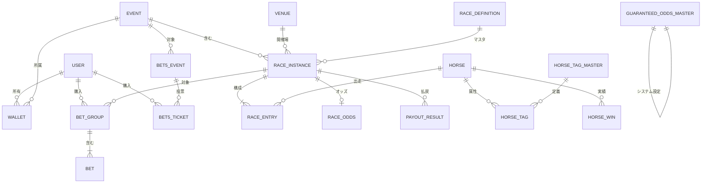

# データベース設計 (Database Design)

## 概要

Paper Tipster アプリケーションのデータ構造を定義します。
PostgreSQL を使用し、Drizzle ORM でスキーマを管理します。
スキーマの正（Single Source of Truth）は `src/shared/db/schema.ts` です。

---

## テーブル定義

### `user` (NextAuth 構成)

NextAuth.js の標準テーブル構成に従い、アプリケーション固有のカラムを拡張しています。

| カラム名                | 型        | 必須 | 説明                                                         |
| :---------------------- | :-------- | :--- | :----------------------------------------------------------- |
| `id`                    | Text      | Yes  | 主キー (UUID)                                                |
| `name`                  | Text      | No   | ユーザー名                                                   |
| `email`                 | Text      | No   | メールアドレス (Unique)                                      |
| `emailVerified`         | Timestamp | No   | メール確認日時                                               |
| `image`                 | Text      | No   | アイコンURL                                                  |
| `role`                  | Enum      | Yes  | 'USER', 'ADMIN', 'GUEST', 'TIPSTER', 'AI_TIPSTER', 'AI_USER' |
| `guestCodeId`           | Text      | No   | 使用したゲストコード                                         |
| `password`              | Text      | No   | 絵文字パスワード (ゲスト用)                                  |
| `isOnboardingCompleted` | Boolean   | Yes  | オンボーディング完了フラグ (デフォルト: false)               |
| `disabledAt`            | Timestamp | No   | 凍結日時 (NULLなら有効)                                      |
| `createdAt`             | Timestamp | Yes  | 作成日時                                                     |
| `updatedAt`             | Timestamp | Yes  | 更新日時                                                     |

### `guest_code` (ゲストコード)

ゲスト登録用の招待コード。

| カラム名     | 型        | 必須 | 説明                      |
| :----------- | :-------- | :--- | :------------------------ |
| `code`       | Text      | Yes  | 主キー (招待コード文字列) |
| `title`      | Text      | Yes  | 用途タイトル              |
| `createdBy`  | Text      | Yes  | `user.id` への外部キー    |
| `disabledAt` | Timestamp | No   | 無効化日時                |
| `createdAt`  | Timestamp | Yes  | 作成日時                  |

### `wallet`

ユーザーの所持金（イベント通貨）を管理するウォレット。

| カラム名      | 型        | 必須 | 説明                         |
| :------------ | :-------- | :--- | :--------------------------- |
| `id`          | UUID      | Yes  | 主キー                       |
| `userId`      | Text      | Yes  | `user.id` への外部キー       |
| `eventId`     | UUID      | Yes  | `event.id` への外部キー      |
| `balance`     | BigInt    | Yes  | 現在の残高 (デフォルト: 0)   |
| `totalLoaned` | BigInt    | Yes  | 借入累計金額 (デフォルト: 0) |
| `createdAt`   | Timestamp | Yes  | 作成日時                     |

**インデックス**: `(userId, eventId)` 複合インデックス

### `transaction`

口座の資金移動履歴。

| カラム名      | 型        | 必須 | 説明                                                            |
| :------------ | :-------- | :--- | :-------------------------------------------------------------- |
| `id`          | UUID      | Yes  | 主キー                                                          |
| `walletId`    | UUID      | Yes  | `wallet.id` への外部キー                                        |
| `type`        | Enum      | Yes  | 'DISTRIBUTION', 'BET', 'PAYOUT', 'REFUND', 'ADJUSTMENT', 'LOAN' |
| `amount`      | BigInt    | Yes  | 変動金額（差分）                                                |
| `referenceId` | UUID      | No   | 関連するID (レースIDやチケットID等)                             |
| `createdAt`   | Timestamp | Yes  | 取引日時                                                        |

**インデックス**: `referenceId`, `walletId`

### `venue` (競馬場)

競馬場のマスタデータ。

| カラム名           | 型        | 必須 | 説明                                               |
| :----------------- | :-------- | :--- | :------------------------------------------------- |
| `id`               | UUID      | Yes  | 主キー                                             |
| `name`             | Text      | Yes  | 競馬場名 (例: 中山)                                |
| `shortName`        | Text      | Yes  | 略称 (例: 中山)                                    |
| `code`             | Text      | No   | JRA会場コード (例: 06)                             |
| `defaultDirection` | Enum      | Yes  | デフォルトの回り方向 ('LEFT', 'RIGHT', 'STRAIGHT') |
| `area`             | Enum      | Yes  | 'EAST_JAPAN', 'WEST_JAPAN', 'OVERSEAS'             |
| `createdAt`        | Timestamp | Yes  | 作成日時                                           |

### `horse_tag_master` (馬タグマスタ)

馬に付与するタグのマスタ。

| カラム名    | 型        | 必須 | 説明                                                |
| :---------- | :-------- | :--- | :-------------------------------------------------- |
| `id`        | UUID      | Yes  | 主キー                                              |
| `type`      | Enum      | Yes  | 'STRATEGY' (脚質), 'TRAIT' (特性), 'HISTORY' (来歴) |
| `content`   | Text      | Yes  | タグ内容                                            |
| `createdAt` | Timestamp | Yes  | 作成日時                                            |

### `horse` (競走馬)

競走馬の情報。

| カラム名    | 型        | 必須 | 説明                                          |
| :---------- | :-------- | :--- | :-------------------------------------------- |
| `id`        | UUID      | Yes  | 主キー                                        |
| `name`      | Text      | Yes  | 馬名                                          |
| `gender`    | Enum      | Yes  | 'MARE', 'FILLY', 'HORSE', 'COLT', 'GELDING'   |
| `age`       | Integer   | No   | 年齢                                          |
| `type`      | Enum      | Yes  | 'REAL' (実在), 'FICTION' (非実在)             |
| `origin`    | Enum      | Yes  | 'DOMESTIC', 'FOREIGN_BRED', 'FOREIGN_TRAINED' |
| `notes`     | Text      | No   | 備考                                          |
| `sireId`    | UUID      | No   | 父馬ID                                        |
| `damId`     | UUID      | No   | 母馬ID                                        |
| `createdAt` | Timestamp | Yes  | 登録日時                                      |
| `updatedAt` | Timestamp | Yes  | 更新日時                                      |

### `horse_tag` (馬タグ紐付け)

馬とタグの関連付けテーブル。

| カラム名    | 型        | 必須 | 説明                    |
| :---------- | :-------- | :--- | :---------------------- |
| `id`        | UUID      | Yes  | 主キー                  |
| `horseId`   | UUID      | Yes  | `horse.id` への外部キー |
| `type`      | Enum      | Yes  | タグ種別                |
| `content`   | Text      | Yes  | タグ内容                |
| `createdAt` | Timestamp | Yes  | 作成日時                |

### `horse_win` (馬の勝利記録)

馬の過去の勝利記録（タイトルなど）を管理するテーブル。

| カラム名           | 型        | 必須 | 説明                              |
| :----------------- | :-------- | :--- | :-------------------------------- |
| `id`               | UUID      | Yes  | 主キー                            |
| `horseId`          | UUID      | Yes  | `horse.id` への外部キー           |
| `raceInstanceId`   | UUID      | No   | `race_instance.id` への外部キー   |
| `raceDefinitionId` | UUID      | No   | `race_definition.id` への外部キー |
| `title`            | Text      | Yes  | タイトル名                        |
| `date`             | Date      | No   | 日付                              |
| `createdAt`        | Timestamp | Yes  | 作成日時                          |

### `race_definition` (レースマスタ)

重賞などのレース条件マスタ。

| カラム名           | 型        | 必須 | 説明                                       |
| :----------------- | :-------- | :--- | :----------------------------------------- |
| `id`               | UUID      | Yes  | 主キー                                     |
| `name`             | Text      | Yes  | レース名 (例: 有馬記念)                    |
| `code`             | Text      | No   | レースコード                               |
| `grade`            | Enum      | Yes  | 'G1', 'G2', 'G3', 'LISTED', 'OPEN', 'NONE' |
| `type`             | Enum      | Yes  | 'REAL', 'FICTION'                          |
| `defaultDirection` | Enum      | Yes  | 回り方向                                   |
| `defaultDistance`  | Integer   | Yes  | 距離                                       |
| `defaultVenueId`   | UUID      | Yes  | デフォルト競馬場 (`venue.id`)              |
| `defaultSurface`   | Text      | Yes  | 芝/ダート                                  |
| `createdAt`        | Timestamp | Yes  | 作成日時                                   |

### `event`

一連のレースをまとめた開催単位。

| カラム名             | 型        | 必須 | 説明                                                                 |
| :------------------- | :-------- | :--- | :------------------------------------------------------------------- |
| `id`                 | UUID      | Yes  | 主キー                                                               |
| `name`               | Text      | Yes  | イベント名                                                           |
| `description`        | Text      | No   | 説明                                                                 |
| `distributeAmount`   | BigInt    | Yes  | 参加時の初期配布金額                                                 |
| `loanAmount`         | BigInt    | No   | 借入可能金額 (NULL時は`distributeAmount`と同額)                      |
| `carryoverAmount`    | BigInt    | Yes  | キャリーオーバー額 (デフォルト: 0)                                   |
| `status`             | Enum      | Yes  | 'SCHEDULED', 'ACTIVE', 'COMPLETED'                                   |
| `rankingDisplayMode` | Enum      | Yes  | 'HIDDEN', 'ANONYMOUS', 'FULL', 'FULL_WITH_LOAN' (デフォルト: HIDDEN) |
| `date`               | Date      | Yes  | 開催日                                                               |
| `createdAt`          | Timestamp | Yes  | 作成日時                                                             |
| `updatedAt`          | Timestamp | Yes  | 更新日時                                                             |

### `guaranteed_odds_master` (保証オッズマスタ)

システム全体で適用されるデフォルト保証オッズ。新規レース作成時の初期値として使用される。

| カラム名    | 型        | 必須 | 説明                                |
| :---------- | :-------- | :--- | :---------------------------------- |
| `key`       | Text      | Yes  | 主キー (券種キー: win, place, etc.) |
| `odds`      | Numeric   | Yes  | 保証オッズ値                        |
| `updatedAt` | Timestamp | Yes  | 更新日時                            |

### `race_instance` (レースインスタンス)

実際に馬券購入の対象となる個別のレース。

| カラム名           | 型   | 必須 | 説明                              |
| :----------------- | :--- | :--- | :-------------------------------- |
| `id`               | UUID | Yes  | 主キー                            |
| `eventId`          | UUID | Yes  | `event.id` への外部キー           |
| `raceDefinitionId` | UUID | No   | `race_definition.id` への外部キー |
| `date`             | Date | Yes  | 開催日                            |
| `venueId`          | UUID | Yes  | `venue.id` への外部キー           |

| `name` | Text | Yes | レース名 |
| `raceNumber` | Integer | No | レース番号 (1-12) |
| `distance` | Integer | Yes | 距離 (メートル) |
| `surface` | Text | Yes | コース種別 (芝/ダート) |
| `condition` | Text | No | 馬場状態 (良/稍重/重/不良) |
| `grade` | Enum | No | 格付け |
| `direction` | Enum | No | 回り方向 |
| `type` | Enum | Yes | 'REAL', 'FICTION' (デフォルト: REAL) |
| `status` | Enum | Yes | 'SCHEDULED', 'CLOSED', 'FINALIZED', 'CANCELLED' |
| `closingAt` | Timestamp | No | 投票締切時刻（キッチンタイマー用） |
| `finalizedAt` | Timestamp | No | 払い戻し確定日時 |
| `guaranteedOdds` | JSONB | No | 保証オッズ (券種 → 倍率) |
| `createdAt` | Timestamp | Yes | 作成日時 |
| `updatedAt` | Timestamp | Yes | 更新日時 |

**インデックス**: `eventId`, `status`

### `race_entry`

レースへの出走馬（エントリー）情報。

| カラム名         | 型        | 必須 | 説明                               |
| :--------------- | :-------- | :--- | :--------------------------------- |
| `id`             | UUID      | Yes  | 主キー                             |
| `raceId`         | UUID      | Yes  | `race_instance.id` への外部キー    |
| `horseId`        | UUID      | Yes  | `horse.id` への外部キー            |
| `bracketNumber`  | Integer   | No   | 枠番 (1-8)                         |
| `horseNumber`    | Integer   | No   | 馬番 (1-18)                        |
| `jockey`         | Text      | No   | 騎手名                             |
| `weight`         | Integer   | No   | 斤量                               |
| `finishPosition` | Integer   | No   | 着順                               |
| `status`         | Enum      | Yes  | 'ENTRANT', 'SCRATCHED', 'EXCLUDED' |
| `createdAt`      | Timestamp | Yes  | 作成日時                           |
| `updatedAt`      | Timestamp | Yes  | 更新日時                           |

**インデックス**: `raceId`, `(raceId, finishPosition)` 複合インデックス

### `race_odds` (レースオッズ)

レースの単勝・複勝オッズを管理するテーブル。

| カラム名    | 型        | 必須 | 説明                                     |
| :---------- | :-------- | :--- | :--------------------------------------- |
| `id`        | UUID      | Yes  | 主キー                                   |
| `raceId`    | UUID      | Yes  | `race_instance.id` への外部キー (Unique) |
| `winOdds`   | JSONB     | No   | 単勝オッズ (馬番 → オッズ)               |
| `placeOdds` | JSONB     | No   | 複勝オッズ (馬番 → {min, max})           |
| `updatedAt` | Timestamp | Yes  | 更新日時                                 |

### `payout_result` (払戻金結果)

レース確定後の払戻金結果を保持するテーブル。

| カラム名       | 型        | 必須 | 説明                              |
| :------------- | :-------- | :--- | :-------------------------------- |
| `id`           | UUID      | Yes  | 主キー                            |
| `raceId`       | UUID      | Yes  | `race_instance.id` への外部キー   |
| `type`         | Text      | Yes  | 券種 (WIN, PLACE, QUINELLA, etc.) |
| `combinations` | JSONB     | Yes  | 払戻組番と金額のリスト            |
| `createdAt`    | Timestamp | Yes  | 作成日時                          |

### `bet5_event` (BET5イベント)

5つのレースを対象とした5重勝単勝式イベント。

| カラム名             | 型        | 必須 | 説明                                    |
| :------------------- | :-------- | :--- | :-------------------------------------- |
| `id`                 | UUID      | Yes  | 主キー                                  |
| `eventId`            | UUID      | Yes  | `event.id` への外部キー                 |
| `race1Id`〜`race5Id` | UUID      | Yes  | `race_instance.id` への外部キー (各5つ) |
| `initialPot`         | BigInt    | Yes  | 初期ポット金額                          |
| `status`             | Enum      | Yes  | 'SCHEDULED', 'CLOSED', 'FINALIZED'      |
| `createdAt`          | Timestamp | Yes  | 作成日時                                |
| `updatedAt`          | Timestamp | Yes  | 更新日時                                |

### `bet5_ticket` (BET5投票)

ユーザーが購入したBET5のチケット。

| カラム名                         | 型        | 必須 | 説明                         |
| :------------------------------- | :-------- | :--- | :--------------------------- |
| `id`                             | UUID      | Yes  | 主キー                       |
| `bet5EventId`                    | UUID      | Yes  | `bet5_event.id` への外部キー |
| `userId`                         | Text      | Yes  | `user.id` への外部キー       |
| `walletId`                       | UUID      | Yes  | `wallet.id` への外部キー     |
| `race1HorseIds`〜`race5HorseIds` | JSONB     | Yes  | 各レースで選択した馬IDの配列 |
| `amount`                         | BigInt    | Yes  | 購入金額                     |
| `isWin`                          | Boolean   | No   | 的中可否                     |
| `payout`                         | BigInt    | No   | 払戻金                       |
| `createdAt`                      | Timestamp | Yes  | 作成日時                     |

**インデックス**: `bet5EventId`

### `bet_group` (馬券購入グループ)

1回の購入操作（フォーメーション等）で生成される馬券のグループ単位。

| カラム名      | 型        | 必須 | 説明                              |
| :------------ | :-------- | :--- | :-------------------------------- |
| `id`          | UUID      | Yes  | 主キー                            |
| `userId`      | Text      | Yes  | `user.id` への外部キー            |
| `raceId`      | UUID      | Yes  | `race_instance.id` への外部キー   |
| `walletId`    | UUID      | Yes  | `wallet.id` への外部キー          |
| `type`        | Text      | Yes  | 券種 (WIN, PLACE, QUINELLA, etc.) |
| `totalAmount` | BigInt    | Yes  | グループ全体の購入金額合計        |
| `createdAt`   | Timestamp | Yes  | 購入日時                          |

### `bet` (馬券)

個別の馬券レコード。`bet_group` に紐づく。

| カラム名     | 型        | 必須 | 説明                                 |
| :----------- | :-------- | :--- | :----------------------------------- |
| `id`         | UUID      | Yes  | 主キー                               |
| `userId`     | Text      | Yes  | `user.id` への外部キー               |
| `raceId`     | UUID      | Yes  | `race_instance.id` への外部キー      |
| `walletId`   | UUID      | Yes  | `wallet.id` への外部キー             |
| `betGroupId` | UUID      | Yes  | `bet_group.id` への外部キー          |
| `details`    | JSONB     | Yes  | 買い目の詳細 (馬番配列)              |
| `amount`     | BigInt    | Yes  | 購入金額                             |
| `odds`       | Numeric   | No   | オッズ                               |
| `payout`     | BigInt    | No   | 払戻金                               |
| `status`     | Enum      | Yes  | 'PENDING', 'HIT', 'LOST', 'REFUNDED' |
| `createdAt`  | Timestamp | Yes  | 購入日時                             |

**インデックス**: `raceId`, `userId`, `betGroupId`

---

## リレーションシップ図



---

## マスタデータの管理

本アプリケーションの初期マスタデータは `src/shared/db/seeds/` 配下の JSON ファイルで管理されています。

### 管理対象

- **競馬場 (`venue`)**: `seeds/venues.json`
- **レース定義 (`race_definition`)**: `seeds/races.json`
- **馬マスタ (`horse`, `horse_tag`, `horse_win`)**: `seeds/horses.json`

### 反映方法

JSON ファイルを編集後、以下のコマンドを実行します。

```bash
pnpm db:seed
```

シードスクリプトは既存のデータをチェックし、存在しないレコードのみを追加します（重複追加は行われません）。
