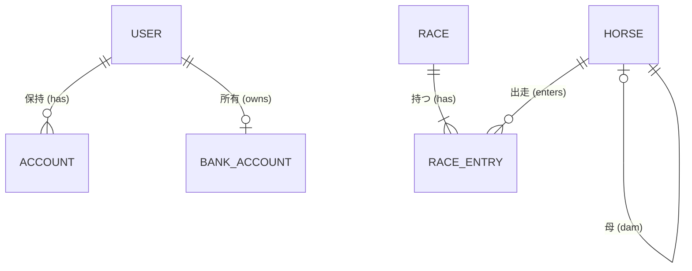

# データベース設計ガイド

本ドキュメントでは、Japan Ranranru Racing Association アプリケーションのデータベーススキーマとリレーションシップについて概説します。

データベースには **PostgreSQL** を使用し、スキーマ定義とクエリ操作には **Drizzle ORM** を採用しています。

## 概要

データベースは主に以下の3つのサブシステムで構成されています。

1.  **認証 (Authentication)**: ユーザー、アカウント、セッション (Auth.js連携)
2.  **経済 (Economy)**: 銀行口座、ボーナスイベント
3.  **レースデータ (Racing Data)**: 競走馬、開催スケジュール、レース、出走情報

---

## 1. 認証システム (Authentication)

主に Auth.js (NextAuth) によって管理され、アプリケーション独自の拡張を行っています。

### `user` テーブル

ユーザーの基本情報を保存します。
| カラム名 | 型 | 必須 | 説明 |
| :--- | :--- | :--- | :--- |
| `id` | Text (UUID) | Yes | 主キー |
| `name` | Text | No | 表示名 (Discordから取得) |
| `image` | Text | No | アバター画像のURL |
| `role` | Enum ('USER', 'ADMIN') | Yes | アプリケーションの権限レベル。デフォルト: 'USER' |
| `createdAt` | Timestamp | Yes | 作成日時 |
| `updatedAt` | Timestamp | Yes | 更新日時 |

### `account` テーブル

ユーザーとOAuthプロバイダー (Discord) を紐付けます。
| カラム名 | 型 | 必須 | 説明 |
| :--- | :--- | :--- | :--- |
| `userId` | Text | Yes | `user.id` への外部キー |
| `provider` | Text | Yes | プロバイダー名 (例: "discord") |
| `providerAccountId` | Text | Yes | プロバイダー側のユーザーID (例: Discord ID) |
| `type` | Text | Yes | Provider type (oauth, email, etc.) |
| `access_token` | Text | No | OAuth Access Token |
| `refresh_token` | Text | No | OAuth Refresh Token |

> **注記**: `session` および `verificationToken` テーブルもAuth.jsの互換性のために存在しますが、DBセッションを使用しない設定の場合は使用されません。

---

## 2. 経済システム (Economy)

ユーザーごとの独立したイベント財布、詳細な取引履歴を管理します。

### `events` テーブル

資金配布や馬券購入の対象となるイベント（集まり）を定義します。旧 `bonus_events` から移行。
| カラム名 | 型 | 必須 | 説明 |
| :--- | :--- | :--- | :--- |
| `id` | UUID | Yes | 主キー |
| `name` | Text | Yes | イベント名 (例: "第1回 ウィポ会") |
| `description` | Text | No | イベント詳細 |
| `distributeAmount` | BigInt | Yes | 参加者に配布される初期資金 |
| `status` | Enum | Yes | 状態 ('SCHEDULED', 'ACTIVE', 'COMPLETED')。'COMPLETED' になると購入選択肢から除外されます。 |
| `date` | Date | Yes | 開催日 |

### `wallets` テーブル

特定のイベントにおけるユーザーの所持金（財布）。ユーザーはイベントごとに1つのウォレットを持ちます。
| カラム名 | 型 | 必須 | 説明 |
| :--- | :--- | :--- | :--- |
| `id` | UUID | Yes | 主キー |
| `userId` | Text | Yes | `user.id` への外部キー |
| `eventId` | UUID | No | `events.id` への外部キー。将来的にグローバル収支を作る場合はNull許容も検討するが基本は必須。 |
| `balance` | BigInt | Yes | 現在の残高 |
| `createdAt` | Timestamp | Yes | 作成日時 |

### `transactions` テーブル

資金の移動履歴（配布、購入、払戻など）を記録する不変の台帳。
| カラム名 | 型 | 必須 | 説明 |
| :--- | :--- | :--- | :--- |
| `id` | UUID | Yes | 主キー |
| `walletId` | UUID | Yes | `wallets.id` への外部キー |
| `type` | Enum | Yes | 取引種別 ('DISTRIBUTION', 'BET', 'PAYOUT', 'REFUND', 'ADJUSTMENT') |
| `amount` | BigInt | Yes | 変動額（+は入金、-は出金） |
| `referenceId` | UUID | No | 関連する `events.id` または `bets.id` |
| `createdAt` | Timestamp | Yes | 取引日時 |

### `bets` テーブル

馬券の購入記録。
| カラム名 | 型 | 必須 | 説明 |
| :--- | :--- | :--- | :--- |
| `id` | UUID | Yes | 主キー |
| `userId` | Text | Yes | `users.id` への外部キー |
| `raceId` | UUID | Yes | `races.id` への外部キー |
| `walletId` | UUID | Yes | 購入に使用した `wallets.id` |
| `details` | JSONB | Yes | 馬券詳細（式別、馬番など）。例: `{"type": "tansho", "horseNumber": 5}` |
| `amount` | BigInt | Yes | 購入金額 |
| `odds` | Decimal | No | 購入時のオッズ（確定前はNull） |
| `payout` | BigInt | No | 払戻金（未確定/ハズレ時はNullまたは0） |
| `status` | Enum | Yes | 状態 ('PENDING', 'HIT', 'LOST', 'REFUNDED') |
| `createdAt` | Timestamp | Yes | 購入日時 |

---

## 3. レースデータシステム (Racing Data)

競走馬データを保存します。

### `horse` テーブル

競走馬データ。
| カラム名 | 型 | 必須 | 説明 |
| :--- | :--- | :--- | :--- |
| `id` | UUID | Yes | 主キー |
| `name` | Text | Yes | 馬名 |
| `gender` | Text | Yes | 性別 (例: 牡, 牝, セン) |
| `sireId` | UUID | No | 父馬の `horse.id` への参照 (外部キー) |
| `damId` | UUID | No | 母馬の `horse.id` への参照 (外部キー) |

### `race` テーブル

レース情報。WinningPostではレースごとに開催場所を変更できるため、レース単位で開催日と場所を管理します。
| カラム名 | 型 | 必須 | 説明 |
| :--- | :--- | :--- | :--- |
| `id` | UUID | Yes | 主キー |
| `date` | Date | Yes | 開催日 |
| `location` | Text | Yes | 競馬場名 (例: 東京) |
| `raceNumber` | Integer | Yes | レース番号 (1-12) |
| `name` | Text | Yes | レース名 (例: "ジャパンカップ") |
| `startTime` | Timestamp | Yes | 発走時刻 |
| `distance` | Integer | Yes | 距離 (メートル) |
| `surface` | Text | Yes | コース種別 (芝/ダート) |
| `condition` | Text | No | 馬場状態 (良/稍重/重/不良) |
| `status` | Enum | Yes | 状態 ('SCHEDULED', 'CLOSED', 'FINALIZED', 'CANCELLED')。'FINALIZED' で払い戻し確定。 |
| `finalizedAt` | Timestamp | No | 払い戻し確定日時 |
| `createdAt` | Timestamp | Yes | 作成日時 |

### `race_entry` テーブル

レースへの出走馬（エントリー）情報。枠順確定前などはNULLになる可能性があります。
| カラム名 | 型 | 必須 | 説明 |
| :--- | :--- | :--- | :--- |
| `id` | UUID | Yes | 主キー |
| `raceId` | UUID | Yes | `race.id` への外部キー |
| `horseId` | UUID | Yes | `horse.id` への外部キー |
| `bracketNumber` | Integer | No | 枠番 (1-8) |
| `horseNumber` | Integer | No | 馬番 (1-18) |
| `jockey` | Text | No | 騎手名 |
| `weight` | Integer | No | 斤量 |
| `status` | Enum | Yes | 状態 ('ENTRANT', 'SCRATCHED', 'EXCLUDED')。デフォルトは 'ENTRANT'（出走予定）。 |

---

## リレーションシップ図 (概念)

