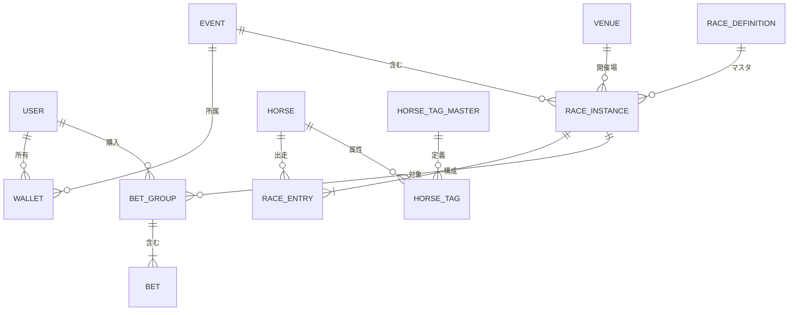

# データベース設計 (Database Design)

## 概要

Paper Tipster アプリケーションのデータ構造を定義します。
PostgreSQL を使用し、Drizzle ORM でスキーマを管理します。

---

## テーブル定義

### `user` (NextAuth 構成)

NextAuth.js の標準テーブル構成に従います。

- `id`: UUID (主キー)
- `name`: テキスト (ユーザー名)
- `email`: テキスト (email、Discordログイン等で使用)
- `image`: テキスト (アイコンURL)
- `role`: Enum ('USER', 'ADMIN', 'GUEST', 'TIPSTER', 'AI_TIPSTER', 'AI_USER')
- `emailVerified`: Timestamp

### `wallet`

ユーザーの所持金（イベント通貨）を管理するウォレット。
| カラム名 | 型 | 必須 | 説明 |
| :--- | :--- | :--- | :--- |
| `id` | UUID | Yes | 主キー |
| `userId` | Text | Yes | `user.id` への外部キー |
| `eventId` | UUID | Yes | `event.id` への外部キー |
| `balance` | Integer | Yes | 現在の残高 (デフォルト: 0) |

### `transaction`

口座の資金移動履歴。
| カラム名 | 型 | 必須 | 説明 |
| :--- | :--- | :--- | :--- |
| `id` | UUID | Yes | 主キー |
| `walletId`| UUID | Yes | `wallet.id` への外部キー |
| `amount` | Integer | Yes | 変動金額（差分） |
| `type` | Enum | Yes | 'DISTRIBUTION', 'BET', 'PAYOUT', 'REFUND', 'ADJUSTMENT' |
| `referenceId` | UUID | No | 関連するID (レースIDやチケットID等) |
| `createdAt` | Timestamp | Yes | 取引日時 |

### `venue` (競馬場)

競馬場のマスタデータ。
| カラム名 | 型 | 必須 | 説明 |
| :--- | :--- | :--- | :--- |
| `id` | UUID | Yes | 主キー |
| `name` | Text | Yes | 競馬場名 (例: 中山) |
| `shortName` | Text | Yes | 略称 (例: 中山) |
| `code` | Text | Yes | JRA会場コード (例: 06) |
| `area` | Enum | Yes | 'EAST', 'WEST', 'OVERSEAS' |
| `defaultDirection` | Enum | Yes | デフォルトの回り方向 ('LEFT', 'RIGHT', 'STRAIGHT') |

### `horse_tag_master` (馬タグマスタ)

馬に付与するタグのマスタ。
| カラム名 | 型 | 必須 | 説明 |
| :--- | :--- | :--- | :--- |
| `id` | UUID | Yes | 主キー |
| `name` | Text | Yes | タグ名 (例: 逃げ) |
| `category` | Enum | Yes | 'STRATEGY' (脚質), 'TRAIT' (特性), 'HISTORY' (来歴) |

### `horse` (競走馬)

競走馬の情報。
| カラム名 | 型 | 必須 | 説明 |
| :--- | :--- | :--- | :--- |
| `id` | UUID | Yes | 主キー |
| `name` | Text | Yes | 馬名 |
| `gender` | Enum | Yes | 性別 ('MARE', 'FILLY', 'HORSE', 'COLT', 'GELDING') |
| `age` | Integer | Yes | 年齢 |
| `type` | Enum | Yes | 'REAL' (実在), 'FICTION' (非実在) |
| `origin` | Enum | Yes | 'DOMESTIC', 'FOREIGN_BRED' |
| `notes` | Text | No | 備考 |
| `createdAt` | Timestamp | Yes | 登録日時 |

### `horse_tag` (馬タグ紐付け)

馬とタグの関連付けテーブル。

| カラム名  | 型   | 必須 | 説明                    |
| :-------- | :--- | :--- | :---------------------- |
| `id`      | UUID | Yes  | 主キー                  |
| `horseId` | UUID | Yes  | `horse.id` への外部キー |
| `type`    | Enum | Yes  | タグ種別                |
| `content` | Text | Yes  | タグ内容                |

### `race_definition` (レース定義)

重賞などのレース条件マスタ。
| カラム名 | 型 | 必須 | 説明 |
| :--- | :--- | :--- | :--- |
| `id` | UUID | Yes | 主キー |
| `name` | Text | Yes | レース名 (例: 有馬記念) |
| `grade` | Enum | Yes | 格付け ('G1', 'G2', 'G3', 'LISTED', 'OPEN', 'NONE') |
| `type` | Enum | Yes | 'REAL', 'FICTION' |
| `defaultDistance` | Integer | Yes | 距離 |
| `defaultSurface` | Enum | Yes | 芝/ダート ('TURF', 'DIRT') |
| `defaultVenueId` | UUID | No | デフォルト競馬場 |
| `defaultDirection` | Enum | No | 回り方向 |

### `event`

一連のレースをまとめた開催単位。

- `id`: UUID (主キー)
- `name`: テキスト (イベント名)
- `status`: Enum ('SCHEDULED', 'ACTIVE', 'COMPLETED')
- `initialBalance`: Integer (参加時の初期配布金額)

### `race_instance` (旧 `race`)

実際に馬券購入の対象となる個別のレース。
| カラム名 | 型 | 必須 | 説明 |
| :--- | :--- | :--- | :--- |
| `id` | UUID | Yes | 主キー |
| `eventId` | UUID | Yes | `event.id` への外部キー |
| `raceDefinitionId` | UUID | No | `race_definition.id` への外部キー |
| `date` | Date | Yes | 開催日 |
| `name` | Text | Yes | レース名（定義から継承または独自設定） |
| `raceNumber` | Integer | Yes | レース番号 (1-12) |
| `venueId` | UUID | Yes | `venue.id` への外部キー |
| `location` | Text | No | 開催場所名 (venue.nameが入る想定だが、現在はvenueId参照推奨) |
| `distance` | Integer | Yes | 距離 (メートル) |
| `surface` | Text | Yes | コース種別 (芝/ダート) |
| `direction` | Enum | Yes | 回り方向 |
| `closingAt` | Timestamp | No | 投票締切時刻（キッチンタイマー用） |
| `condition` | Text | No | 馬場状態 (良/稍重/重/不良) |
| `status` | Enum | Yes | 状態 ('SCHEDULED', 'CLOSED', 'FINALIZED', 'CANCELLED') |
| `finalizedAt` | Timestamp | No | 払い戻し確定日時 |
| `createdAt` | Timestamp | Yes | 作成日時 |

### `race_entry`

レースへの出走馬（エントリー）情報。
| カラム名 | 型 | 必須 | 説明 |
| :--- | :--- | :--- | :--- |
| `id` | UUID | Yes | 主キー |
| `raceId` | UUID | Yes | `race_instance.id` への外部キー |
| `horseId` | UUID | Yes | `horse.id` への外部キー |
| `bracketNumber` | Integer | No | 枠番 (1-8) |
| `horseNumber` | Integer | No | 馬番 (1-18) |
| `jockey` | Text | No | 騎手名 |
| `weight` | Integer | No | 斤量 |
| `status` | Enum | Yes | 状態 ('ENTRANT', 'SCRATCHED', 'EXCLUDED') |

### `race_odds` (レースオッズ)

レースの単勝・複勝オッズを管理するテーブル。
| カラム名 | 型 | 必須 | 説明 |
| :--- | :--- | :--- | :--- |
| `id` | UUID | Yes | 主キー |
| `raceId` | UUID | Yes | `race_instance.id` への外部キー (Unique) |
| `winOdds` | JSONB | No | 単勝オッズ (馬番 -> オッズ) |
| `placeOdds` | JSONB | No | 複勝オッズ (馬番 -> {min, max}) |
| `updatedAt` | Timestamp | Yes | 更新日時 |

### `horse_win` (馬の勝利記録)

馬の過去の勝利記録（タイトルなど）を管理するテーブル。
| カラム名 | 型 | 必須 | 説明 |
| :--- | :--- | :--- | :--- |
| `id` | UUID | Yes | 主キー |
| `horseId` | UUID | Yes | `horse.id` への外部キー |
| `raceInstanceId` | UUID | No | `race_instance.id` への外部キー |
| `raceDefinitionId` | UUID | No | `race_definition.id` への外部キー |
| `title` | Text | Yes | タイトル名 |
| `date` | Date | No | 日付 |

### `payout_result` (払戻金結果)

レース確定後の払戻金結果を保持するテーブル。
| カラム名 | 型 | 必須 | 説明 |
| :--- | :--- | :--- | :--- |
| `id` | UUID | Yes | 主キー |
| `raceId` | UUID | Yes | `race_instance.id` への外部キー |
| `type` | Text | Yes | 券種 (WIN, PLACE, QUINELLA, etc.) |
| `combinations` | JSONB | Yes | 払戻組番と金額のリスト |

### `bet5_event` (BET5イベント)

5つのレースを対象とした5重勝単勝式イベント。

| カラム名             | 型      | 必須 | 説明                               |
| :------------------- | :------ | :--- | :--------------------------------- |
| `id`                 | UUID    | Yes  | 主キー                             |
| `eventId`            | UUID    | Yes  | `event.id` への外部キー            |
| `race1Id`〜`race5Id` | UUID    | Yes  | `race_instance.id` への外部キー    |
| `initialPot`         | Integer | Yes  | 初期ポット金額                     |
| `status`             | Enum    | Yes  | 'SCHEDULED', 'CLOSED', 'FINALIZED' |

### `bet5_ticket` (BET5投票)

ユーザーが購入したBET5のチケット。

| カラム名                         | 型      | 必須 | 説明                         |
| :------------------------------- | :------ | :--- | :--------------------------- |
| `id`                             | UUID    | Yes  | 主キー                       |
| `bet5EventId`                    | UUID    | Yes  | `bet5_event.id` への外部キー |
| `userId`                         | Text    | Yes  | `user.id` への外部キー       |
| `walletId`                       | UUID    | Yes  | `wallet.id` への外部キー     |
| `race1HorseIds`〜`race5HorseIds` | JSONB   | Yes  | 各レースで選択した馬IDの配列 |
| `amount`                         | Integer | Yes  | 購入金額                     |
| `isWin`                          | Boolean | No   | 的中可否                     |
| `payout`                         | Integer | No   | 払戻金                       |

### `bet_group` (馬券購入グループ)

1回の購入操作（フォーメーション等）で生成される馬券のグループ単位。
| カラム名 | 型 | 必須 | 説明 |
| :--- | :--- | :--- | :--- |
| `id` | UUID | Yes | 主キー |
| `userId` | Text | Yes | `user.id` への外部キー |
| `raceId` | UUID | Yes | `race_instance.id` への外部キー |
| `walletId` | UUID | Yes | `wallet.id` への外部キー |
| `type` | Text | Yes | 券種 (WIN, PLACE, QUINELLA, etc.) |
| `totalAmount` | BigInt | Yes | グループ全体の購入金額合計 |
| `createdAt` | Timestamp | Yes | 購入日時 |

### `bet` (馬券)

個別の馬券レコード。`bet_group` に紐づく。

| カラム名     | 型        | 必須 | 説明                                 |
| :----------- | :-------- | :--- | :----------------------------------- |
| `id`         | UUID      | Yes  | 主キー                               |
| `userId`     | Text      | Yes  | `user.id` への外部キー               |
| `raceId`     | UUID      | Yes  | `race_instance.id` への外部キー      |
| `walletId`   | UUID      | Yes  | `wallet.id` への外部キー             |
| `betGroupId` | UUID      | Yes  | `bet_group.id` への外部キー          |
| `details`    | JSONB     | Yes  | 買い目の詳細 (馬番配列)              |
| `amount`     | BigInt    | Yes  | 購入金額                             |
| `odds`       | Numeric   | No   | オッズ                               |
| `status`     | Enum      | Yes  | 'PENDING', 'HIT', 'LOST', 'REFUNDED' |
| `payout`     | BigInt    | No   | 払戻金                               |
| `createdAt`  | Timestamp | Yes  | 購入日時                             |

---

## リレーションシップ図 (概念)

