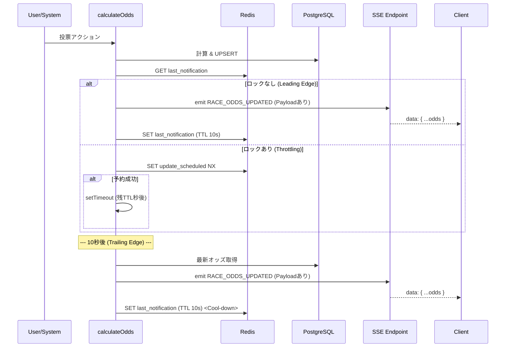

# オッズシステム仕様書

## 1. 概要

このドキュメントは、オッズの計算・配信・表示の仕組みを説明します。
Server-Sent Events (SSE) によるリアルタイム更新と、Redisを使った負荷対策（Leading / Trailing Edge Throttling）が主なポイントです。

## 2. オッズ計算ロジック

**ファイル**: `src/features/betting/logic/odds.ts`

- **トリガー**: `calculateOdds(raceId)` が呼ばれた時（主に投票確定時）
- **計算対象**:
  - 現在は `単勝 (WIN)` のみが計算対象です。
- **計算式**:
  1.  **総投票数 (Pool)**: そのレースの単勝投票総額を集計します。
  2.  **個別オッズ**: 総投票数を各馬への投票額で割ります（控除なし）。
      - `Odds = Pool / Vote Amount`
  3.  **端数処理**: 小数点第2位以下を切り捨てます（例: 2.46 -> 2.4）。
  4.  **最低保証**: 1.1倍未満にはしません（JRA準拠）。
  5.  **ゼロ除算対策**: 投票数が0の場合はオッズを `0.0` にします。

### 2.2 BET5 (5重勝単勝式)

**ファイル**: `src/features/betting/logic/bet5.ts`

- **計算方式**: キャリーオーバー方式（プール制）
- **オッズ**: 固定オッズではなく、的中者数で山分けします。
- **計算式**:
  1. **総ポット (Total Pot)**: `Initial Pot` + `Total Sales` (当回の売上) + `Event Carryover` (的中者なしレースの累計売上)
  2. **配当 (Dividend)**: `Total Pot / Winner Count` (小数点以下切り捨て)
  3. **特記事項**: 控除率は0%で、総取り方式です。的中者がいない場合は `carryoverAmount` に加算し、次回の払い戻しポットへ繰り越します。

### 2.3 最低保証オッズ (Guaranteed Odds)

各券種には、夢と堅実さのバランスを考慮した「最低保証オッズ（デフォルト値）」が設定されています。
これらは**システム全体のマスターデータ**として管理し、新規レース作成時の初期値に使います。
※ 作成済みレースの保証オッズは、レース編集画面で個別に変更できます。

**デフォルト保証オッズ設定値**

| キー               | 券種   | デフォルト倍率 | 解説・理由                                                                          |
| :----------------- | :----- | :------------- | :---------------------------------------------------------------------------------- |
| `win`              | 単勝   | **3.5 倍**     | 1番人気(2倍前後)より少し夢があり、中穴(5倍)には届かない絶妙なライン。               |
| `place`            | 複勝   | **1.5 倍**     | 堅実な投資として機能するライン。「元返し」を防ぐ最低限の保証。                      |
| `bracket_quinella` | 枠連   | **8.0 倍**     | ゾロ目や人気決着でもそこそこ美味しいと思える値。                                    |
| `quinella`         | 馬連   | **15.0 倍**    | 適当に買っても「15倍もらえるなら」と納得できるライン。                              |
| `wide`             | ワイド | **5.0 倍**     | 的中しやすい券種なので、これくらいがインフレを防ぎつつ魅力的。                      |
| `exacta`           | 馬単   | **30.0 倍**    | 着順指定の難易度に見合う、分かりやすい「30倍」というキリ番。                        |
| `trifecta`         | 3連単  | **200.0 倍**   | **重要**。夢の万馬券（100倍超え）を確約しつつ、大荒れ時のプール配当には負ける設定。 |
| `trio`             | 3連複  | **40.0 倍**    | 馬単より少し高く、当てやすさとのバランスが良い値。                                  |

## 3. データ保存と配信フロー

### データベース (PostgreSQL)

- **テーブル**: `race_odds`
- **保存内容**: 計算した `winOdds` (JSONB)、`placeOdds` (JSONB)、`updatedAt` を保存します。
- **更新**: `raceId` をキーに UPSERT（On Conflict Do Update）します。
- **計算頻度**: スロットリングの有無に関係なく、**計算とDB保存は毎リクエストで実行**します。

### Redis (Throttling)

- **目的**: 短時間の連続配信を抑えつつ、最終状態を確実に届けるためです。
- **キー**:
  - `race:{raceId}:last_odds_notification`: 通知ロック（TTL 10秒）
  - `race:{raceId}:update_scheduled`: 遅延実行予約ロック
- **動作 (Leading & Trailing Edge)**:
  1.  **Leading Edge (即時実行)**:
      - `last_odds_notification` がない場合、即座にイベントを発行し、ロックをセットします。
  2.  **Trailing Edge (遅延実行)**:
      - ロック中にリクエストがあった場合、`update_scheduled` をチェック（Atomic SET NX）。
      - 未予約であれば、`setTimeout` でロック解除時刻に合わせて実行を予約します。
  3.  **Cool-down**:
      - Trailing Edge での実行直後に、再度 `last_odds_notification` ロックを10秒間セットします。
      - これにより、高負荷時でも「更新 -> 10秒待機 -> 更新 -> 10秒待機」というサイクルが保たれます。

### SSE (Server-Sent Events)

- **ファイル**: `src/app/api/events/race-status/route.ts`, `src/shared/lib/sse/event-emitter.ts`
- **仕組み**: Node.js の `EventEmitter`（`raceEventEmitter`）をシングルトンで利用します。
- **ペイロード**: 計算済みのオッズデータを含みます。
  ```json
  {
    "type": "RACE_ODDS_UPDATED",
    "raceId": "...",
    "data": {
      "winOdds": {...},
      "placeOdds": {...},
      "updatedAt": "2024-01-01T12:00:00Z"
    }
  }
  ```

## 4. クライアント側の挙動

**ファイル**: `src/features/betting/lib/hooks/use-race-odds.ts`, `src/features/betting/ui/bet-table.tsx`

- **接続**: `useRaceEvents` フックで SSE エンドポイントに接続します。
- **イベント受信**: `RACE_ODDS_UPDATED` を受け取ると、`handleOddsUpdated` が実行されます。
- **データ更新**: ペイロード内の `data` を直接使って状態を更新します（**Fetch不要**）。
  - これにより、"Thundering Herd"（一斉アクセスによる負荷増大）を回避します。
- **表示**:
  - オッズ値をテーブルに反映。
  - 「オッズ最終更新: HH:mm:ss」をテーブル上部に表示。
  - 更新時にトースト通知を表示。

## 5. まとめ図解


